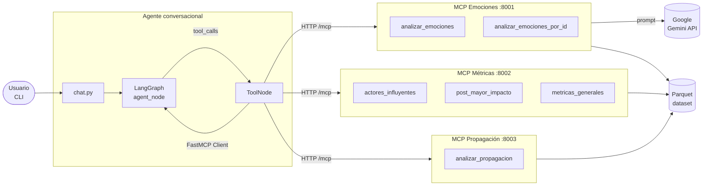
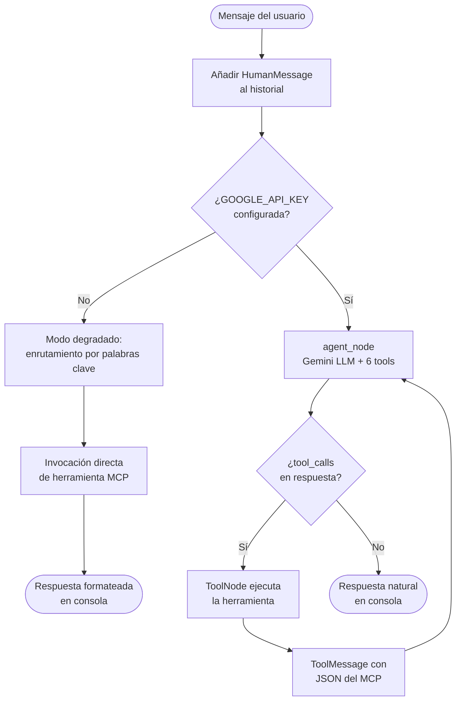
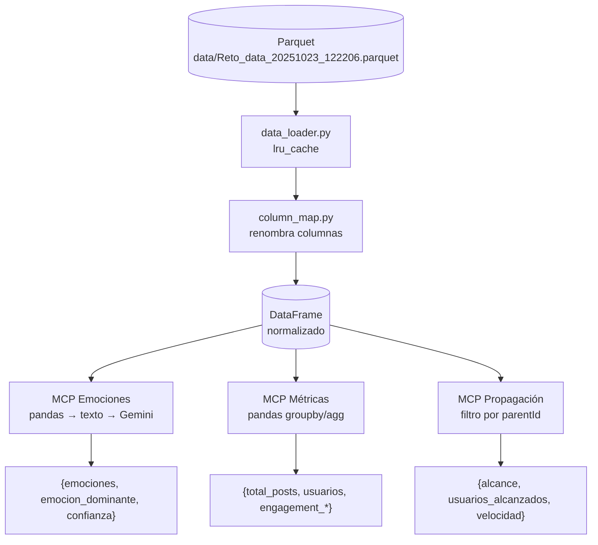

# Arquitectura del sistema — Reto ICESI

El sistema está compuesto por tres microservicios MCP independientes y un agente conversacional orquestado con LangGraph. Cada servicio expone herramientas analíticas que el agente consume bajo demanda según la intención del usuario. El dataset fuente es un archivo Parquet que se carga una sola vez en memoria y se comparte entre los servicios a través del módulo `shared/`.

---

## Arquitectura general

---

## Flujo del agente conversacional

---

## Flujo de datos

---

## Puertos y endpoints

| Servicio      | Puerto | Transporte     | Herramientas disponibles                                          |
|---------------|--------|----------------|-------------------------------------------------------------------|
| emociones     | 8001   | HTTP `/mcp`    | `analizar_emociones`, `analizar_emociones_por_id`                 |
| metricas      | 8002   | HTTP `/mcp`    | `actores_influyentes`, `post_mayor_impacto`, `metricas_generales` |
| propagacion   | 8003   | HTTP `/mcp`    | `analizar_propagacion`                                            |

Los tres servicios se inician con `python services/<nombre>/main.py` y exponen el transporte FastMCP HTTP en `http://127.0.0.1:<puerto>/mcp`. El agente los consume a través del cliente `fastmcp.Client` configurado con las variables de entorno `MCP_EMOCIONES_URL`, `MCP_METRICAS_URL` y `MCP_PROPAGACION_URL`.
